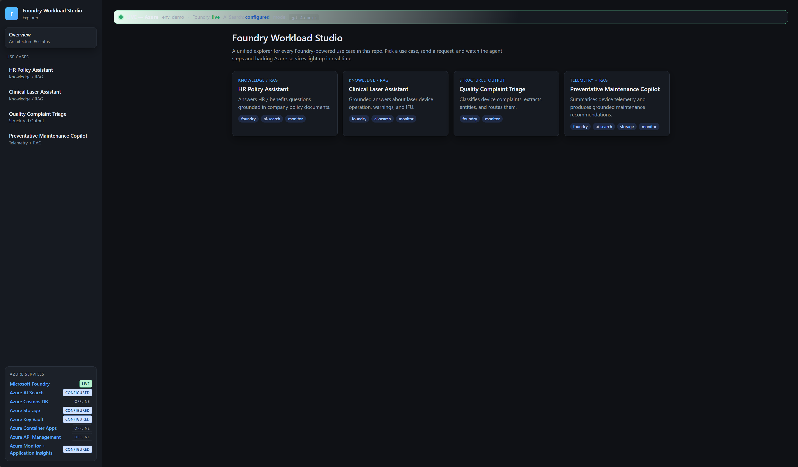
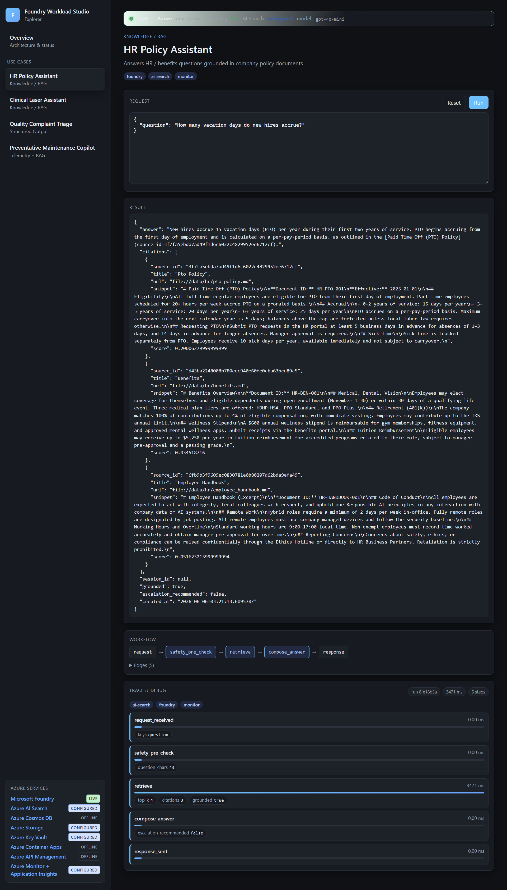
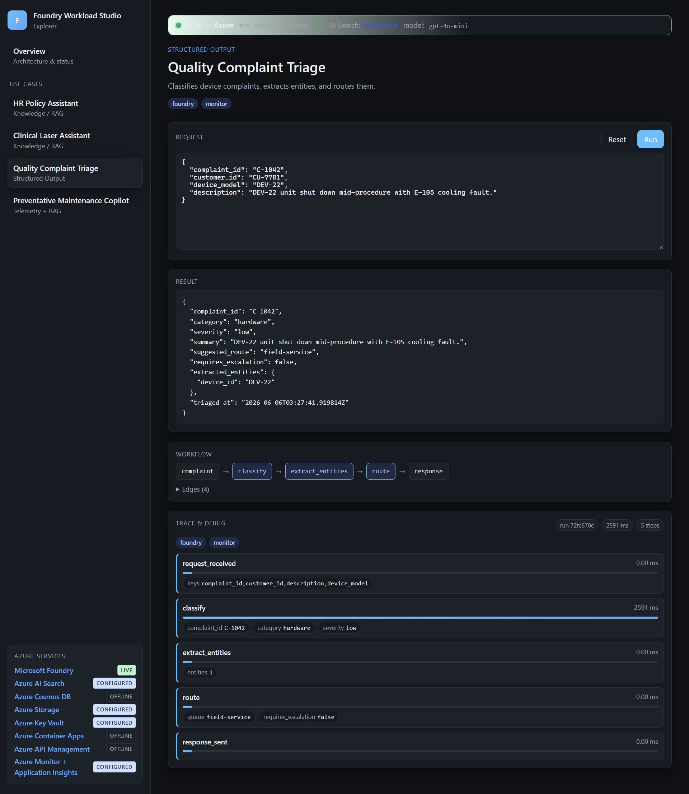
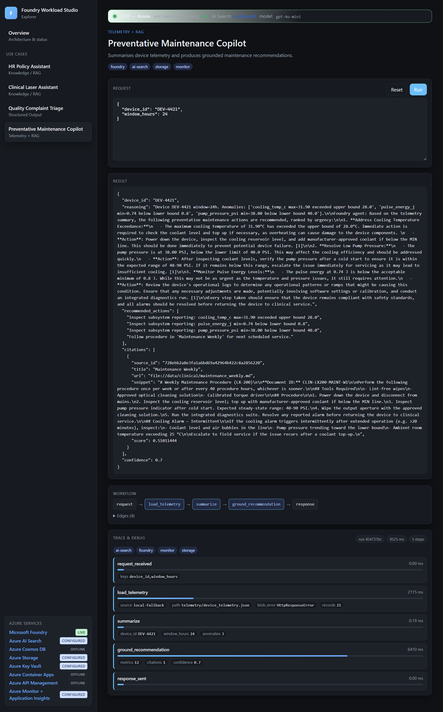
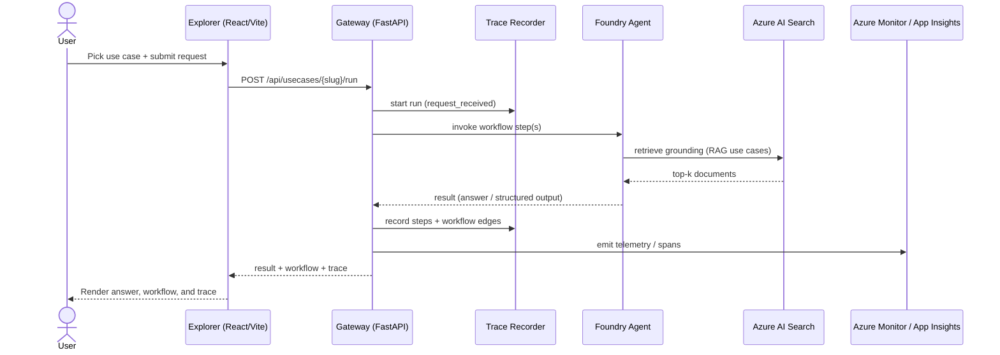
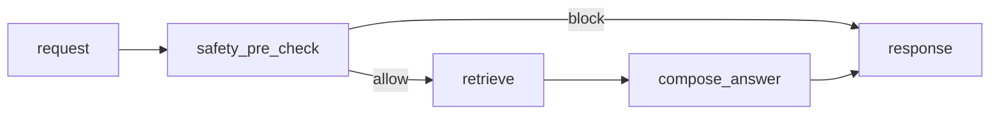
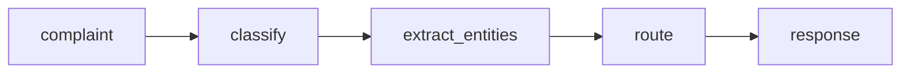
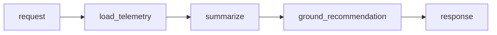

# Foundry Workload Studio

> Reusable Field IP for Governed, Production-Ready AI Workloads

A production-minded **Microsoft Foundry** accelerator demonstrating how a single governed AI platform can power multiple business-aligned workloads through reusable architecture, shared governance, enterprise observability, and operationally mature deployment patterns.

Foundry Workload Studio is designed as reusable, to rapidly build, adapt, and operationalize AI workloads spanning retrieval-augmented generation (RAG), agentic workflows, customer-facing copilots, and telemetry-informed operational intelligence.

This repository demonstrates how Microsoft Foundry can power four representative workloads spanning internal productivity, external customer engagement, agentic workflows, and operational intelligence:

1. **HR Benefits & Policy Search** — Internal GenAI assistant
2. **Clinical Laser Product Q&A Assistant** — External customer chatbot
3. **Quality Complaint Triage** — Agentic workflow
4. **Preventative Maintenance Copilot** — Telemetry + knowledge insights

The goal of this initiative is to help customers:

- Reduce repetitive manual work
- Improve employee efficiency
- Enable scalable AI-driven knowledge access
- Introduce governed agentic workflows
- Accelerate operational decision-making
- Provide a reusable foundation from **POC → Pilot → Production**

## Explorer UI

The repo ships with a React + Vite **Explorer** that fronts a FastAPI gateway. Pick a use case, send a request, and watch the agent workflow steps, execution trace, and backing Azure services light up in real time. The screenshots below are captured against a live Microsoft Foundry deployment (`gpt-4o-mini`, env `demo`).

### Overview

The landing page lists every registered use case and shows live status for each backing Azure service (Microsoft Foundry **LIVE**, AI Search, Storage, Key Vault, Monitor).



### HR Policy Assistant (RAG)

Grounded answer with citations plus the full workflow and per-step trace.



### Quality Complaint Triage (Agentic / Structured Output)

Classifies a device complaint, extracts entities, and routes it — returning structured JSON with a five-step trace.



### Preventative Maintenance Copilot (Telemetry + RAG)

Summarizes device telemetry and produces grounded maintenance recommendations.



## Use Cases

| # | Use Case | Pattern | Audience |
|---|---|---|---|
| 1 | **HR Benefits & Policy Search** | RAG | Internal employees |
| 2 | **Clinical Laser Product Q&A** | RAG + Safety | External clinicians |
| 3 | **Quality Complaint Triage** | Agentic / Structured Outputs | Quality engineers |
| 4 | **Preventative Maintenance Copilot** | Telemetry + RAG | Field service |

## Business Outcomes

Each use case targets a distinct, measurable business outcome.

### HR
- Reduce repetitive HR policy lookup requests
- Reduce time spent searching benefits documentation
- Increase employee self-service efficiency
- Improve employee onboarding support

### Clinical
- Provide always-on laser product knowledge support for med spa users
- Reduce support ticket volume
- Improve clinical training accessibility
- Support external customer engagement at scale

### Quality
- Automate complaint intake and triage
- Reduce manual classification effort
- Improve routing accuracy
- Accelerate issue escalation workflows

### Preventative Maintenance
- Improve field-service visibility
- Surface possible device maintenance insights
- Reduce downtime through earlier detection patterns
- Combine telemetry with operational knowledge

## Why Microsoft Foundry

- Enterprise-grade AI orchestration
- Open model flexibility (multi-model)
- Agentic workflow execution (Microsoft Agent Framework)
- Retrieval-Augmented Generation
- Built-in evaluation, tracing, and governance
- Production deployment pipelines via Bicep

## Key Foundry Capabilities Demonstrated

| Capability | Demonstrated In |
|---|---|
| RAG / Enterprise Grounding | HR + Clinical |
| Agentic Workflow Orchestration | Quality Complaint Triage |
| Model Evaluation | All workloads |
| Observability & Tracing | All workloads |
| Content Safety | Clinical + HR |
| Retrieval + Vector Search | HR + Maintenance |
| Structured Outputs | Complaint Triage |
| Prompt Governance | All workloads |
| Multi-model Flexibility | Shared platform |
| API-first Architecture | Entire solution |

## Reference Architecture

See [docs/architecture.md](docs/architecture.md) for the full architecture and data flows. The solution composes the following Azure services:

| Service | Purpose |
|---|---|
| **Microsoft Foundry** | AI platform and orchestration |
| **Azure AI Search** | RAG and document search |
| **Azure Container Apps** | API hosting |
| **Azure API Management** | Secure API gateway |
| **Azure Key Vault** | Secret management |
| **Azure Monitor** | Observability |
| **Application Insights** | Tracing and diagnostics |
| **Microsoft Entra ID** | Identity and RBAC |
| **Azure Cosmos DB** | Conversation / session persistence |
| **Azure Blob Storage** | Document ingestion |

## Workflows & Sequence Diagrams

### Request lifecycle (end-to-end)

Every use case flows through the same governed path: the Explorer UI calls the gateway, which records a trace, runs the use-case workflow against a Foundry agent (optionally grounding with AI Search), and returns the result plus the workflow and trace for the UI to render.



### Use-case workflows

The nodes below match the workflow graphs emitted by the gateway (`src/gateway/registry.py`) and rendered live in the Explorer.

**HR Policy Assistant & Clinical Laser Assistant — Grounded RAG**



**Quality Complaint Triage — Structured-output agent**



**Preventative Maintenance Copilot — Telemetry + RAG**



## Repository Structure

```
foundry-workload-studio/
├── docs/                       # Architecture, demo script, pilot plan, security
├── infra/                      # Bicep IaC (WAF-aligned) + dev/demo/prod environments
│   ├── main.bicep
│   ├── modules/                # foundry, search, container apps, apim, kv, monitor, cosmos, storage
│   └── environments/           # dev.bicepparam, demo.bicepparam, prod.bicepparam
├── src/
│   ├── common/                 # Shared config, foundry client, telemetry, models, safety
│   ├── hr_policy_assistant/    # Use case 1
│   ├── clinical_laser_assistant/  # Use case 2
│   ├── quality_complaint_triage/  # Use case 3
│   └── maintenance_copilot/    # Use case 4
├── data/                       # Sample HR docs, clinical docs, complaints, telemetry
├── tests/                      # Unit + integration tests for every component
└── .github/workflows/          # CI
```

## Quickstart (uv)

This project uses [**uv**](https://docs.astral.sh/uv/) — a fast Python package manager.

```bash
# Install uv (if not already installed)
curl -LsSf https://astral.sh/uv/install.sh | sh

# Sync dependencies (creates .venv automatically)
uv sync --extra dev

# Run tests
uv run pytest

# Lint
uv run ruff check .

# Type check
uv run mypy src
```

## Run a use case locally

```bash
cp .env.example .env   # populate with your Foundry endpoint
uv run uvicorn src.hr_policy_assistant.api:app --reload --port 8001
uv run uvicorn src.clinical_laser_assistant.api:app --reload --port 8002
uv run uvicorn src.quality_complaint_triage.api:app --reload --port 8003
uv run uvicorn src.maintenance_copilot.api:app --reload --port 8004
```

## Deploy infrastructure

The `infra/` directory follows the **Microsoft Azure Well-Architected Framework** (Reliability, Security, Cost Optimization, Operational Excellence, Performance Efficiency).

```bash
# Dev
az deployment sub create \
  --location eastus2 \
  --template-file infra/main.bicep \
  --parameters infra/environments/dev.bicepparam

# Demo
az deployment sub create --location eastus2 \
  --template-file infra/main.bicep \
  --parameters infra/environments/demo.bicepparam

# Production
az deployment sub create --location eastus2 \
  --template-file infra/main.bicep \
  --parameters infra/environments/prod.bicepparam
```

## POC → Pilot → Production

| Phase | Characteristics |
|---|---|
| **POC** | Local dev, synthetic data, baseline prompts, manual eval |
| **Pilot** | Secure Azure deploy (`dev`/`demo`), Entra ID, usage logging, eval dashboards |
| **Production** | CI/CD, full observability, RBAC, multi-region, DR, governance guardrails |

## Recommended Pilot

**HR Benefits & Policy Search** — fastest measurable ROI, internal audience, lowest governance risk.

## Documentation

- [User Guide](docs/user-guide.md) — mental model, `src/common` toolkit, scripts, running locally vs. live, and how to add a new use case
- [Architecture](docs/architecture.md) — system diagram, data flows, and environment progression
- [Demo Script](docs/demo-script.md) — guided 30-minute walkthrough
- [Pilot Plan](docs/pilot-plan.md) — POC → Pilot → Production rollout
- [Security & Guardrails](docs/security-guardrails.md) — content safety, identity, and governance

## References

- [Microsoft Foundry docs](https://learn.microsoft.com/en-us/azure/foundry/what-is-foundry?tabs=python)
- [Foundry samples](https://github.com/microsoft-foundry/foundry-samples)
- [Microsoft Agent Framework Samples](https://github.com/microsoft/Agent-Framework-Samples)

## License

MIT
